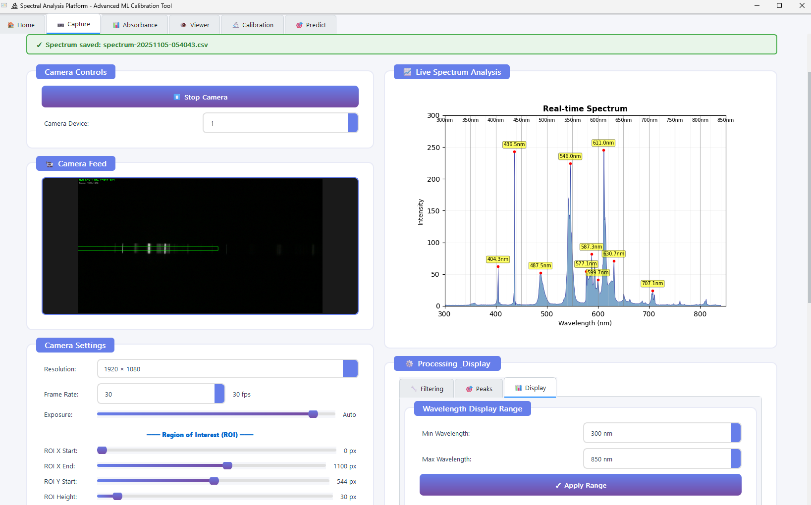
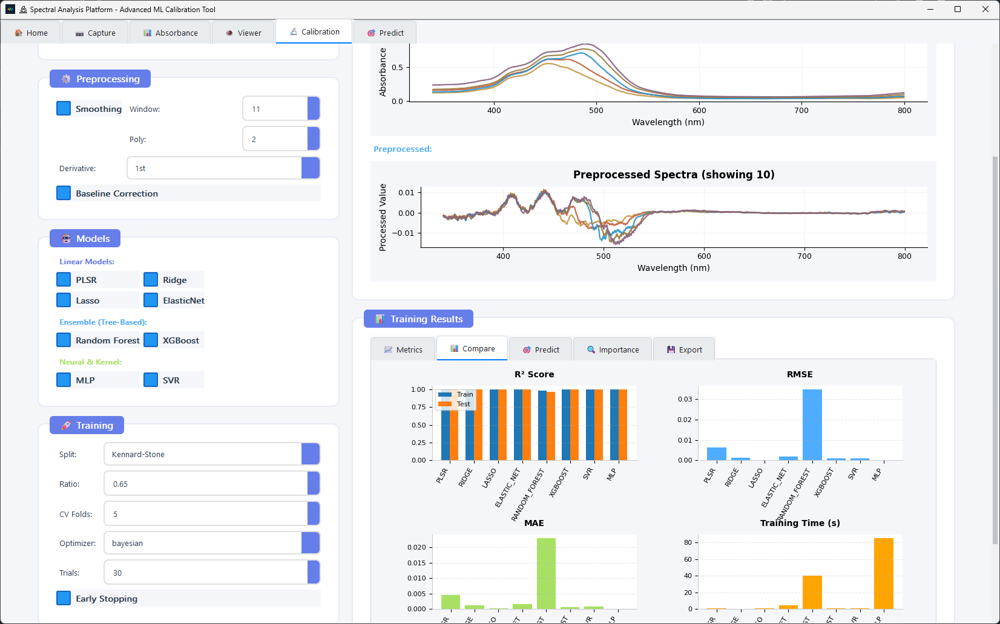

# Spectral Analysis Platform

A comprehensive application for analyzing spectroscopic data and building machine learning models for concentration prediction. Developed to complement a portable CMOS camera-based spectrophotometer for heavy metal detection, built as part of an undergraduate thesis project.

Available as both a **desktop application** (Qt) and **web application** (Streamlit) to suit different workflows and deployment scenarios.

## Features

### Desktop Application (Qt)

The Qt-based desktop application provides a professional interface optimized for real-time spectroscopy workflows. Built with PyQt6, it offers low-latency camera integration and advanced signal processing capabilities.

#### Capture View


*Real-time spectrum acquisition with camera-based spectrometer*

The Capture View transforms any CMOS camera into a precision spectrometer through sophisticated wavelength calibration and signal processing:

**Advanced Wavelength Calibration System**
- **Polynomial Calibration** - Multi-point calibration using known spectral lines (e.g., Hg lamp peaks at 436nm, 546nm) with configurable polynomial degree (linear, quadratic, cubic) for superior accuracy across the entire wavelength range
- **Interactive Peak Selection** - Click-to-mark calibration points directly on the live spectrum with automatic peak detection
- **Persistent Calibration Storage** - Save and load calibration profiles in JSON format for reproducible measurements
- **Theremino Compatibility** - Backward-compatible two-point linear calibration mode for migration from legacy systems

**Real-Time Signal Processing**
- **ROI (Region of Interest) Control** - Adjustable spectral line extraction window with precise pixel-level positioning for optimal signal capture
- **Temporal Filtering** - Sophisticated noise reduction with independent rising/falling speed controls to balance responsiveness and stability
- **Savitzky-Golay Smoothing** - Configurable window size and polynomial order for noise reduction while preserving peak shape
- **Irradiance Correction** - Automatic sensor response compensation using 401-point correction curve (380-780nm) derived from Theremino Spectrometer standards, with extended UV/IR coefficients for full-range accuracy

**Camera Configuration**
- **Full Parameter Control** - Exposure time, gain, FPS, and resolution adjustment for optimal signal-to-noise ratio
- **Live Preview** - Real-time camera feed with ROI overlay visualization
- **Frame Averaging** - Reduce temporal noise through configurable frame averaging
- **Horizontal Flip** - Accommodate different optical configurations

**Peak Detection and Analysis**
- **Automatic Peak Finding** - Configurable threshold and minimum distance parameters with peak hold functionality
- **Color-Coded Wavelength Display** - Graticule overlay with 10nm and 50nm markers using perceptually accurate wavelength-to-RGB conversion
- **Live Intensity Monitoring** - Real-time intensity readout with 0-300 scale and background noise compensation

**Data Export**
- **CSV Export** - Save calibrated spectra with wavelength and intensity columns
- **Metadata Preservation** - Include acquisition parameters and calibration coefficients in file headers

#### Calibration View


*Machine learning model training and evaluation interface*

The Calibration View provides a comprehensive machine learning pipeline for building predictive models from spectroscopic data:

**Intelligent Data Loading**
- **Batch File Import** - Load multiple CSV files simultaneously with automatic wavelength alignment
- **Flexible Concentration Extraction** - Parse concentration values from filenames (e.g., `0.5_a.csv`) or manual entry
- **Automatic Column Detection** - Intelligent identification of wavelength and absorbance columns regardless of naming convention
- **Data Validation** - Pre-training checks for sufficient samples, consistent wavelength grids, and valid concentration ranges

**Advanced Preprocessing Pipeline**
- **Savitzky-Golay Filtering** - Noise reduction with adjustable window size (3-51, odd values) and polynomial order (1-9)
- **Derivative Spectroscopy** - First and second derivative transforms for enhanced peak resolution and baseline elimination
- **Baseline Correction** - Asymmetric Least Squares (ALS) algorithm for removing drift and background fluorescence
- **Live Preview** - Real-time visualization of preprocessing effects on multiple sample spectra

**Multi-Algorithm Model Training**
- **Linear Models**: PLSR (Partial Least Squares Regression), Ridge, Lasso, ElasticNet with automatic component/parameter selection
- **Ensemble Models**: Random Forest and XGBoost with tree-based ensemble learning
- **Neural Networks**: Multi-Layer Perceptron (MLP) with PyTorch backend and customizable architecture
- **Kernel Methods**: Support Vector Regression (SVR) with RBF and linear kernels

**Hyperparameter Optimization**
- **Bayesian Optimization** - Efficient hyperparameter search using scikit-optimize for optimal model configuration in fewer iterations
- **Random Search** - Broader exploration of parameter space for model comparison
- **Grid Search** - Exhaustive search for critical applications requiring guaranteed coverage
- **Configurable Search Space** - Adjustable number of trials (10-200) with early stopping to prevent overfitting

**Robust Model Evaluation**
- **Kennard-Stone Splitting** - Representative train/test splits based on spectral diversity (recommended for small datasets)
- **Random Splitting** - Traditional random split with configurable train ratio (50-95%)
- **K-Fold Cross-Validation** - Configurable 2-10 folds for robust performance estimation on training data
- **Comprehensive Metrics** - R², RMSE, MAE for both training and test sets with color-coded performance indicators

**Rich Visualization Suite**
- **Model Comparison Tab** - Side-by-side bar charts comparing R², RMSE, and MAE across all trained models
- **Prediction Analysis Tab** - Predicted vs. Actual scatter plots with perfect prediction line, regression statistics, and residual analysis
- **Feature Importance Tab** - Wavelength importance plots for tree-based and ensemble models to identify critical absorption bands
- **Training Time Comparison** - Performance benchmarking for deployment considerations

**Model Persistence and Deployment**
- **Export Trained Models** - Save model objects with preprocessing pipeline and metadata in pickle format
- **Export Predictions** - CSV export of test set predictions with actual values and residuals
- **Export Metrics** - JSON export of all training metrics for documentation and reporting
- **Model Reloading** - Load previously trained models for prediction on new data without retraining

**Additional Features**
- **Progress Tracking** - Real-time training progress with cancellation support for long-running optimizations
- **Best Model Selection** - Automatic identification of best-performing model based on test set metrics
- **Tabbed Interface** - Organized workspace with Overview, Comparison, Predictions, and Feature Importance tabs
- **Responsive Design** - Handles datasets from 3 samples to hundreds with appropriate validation warnings

### Web Application (Streamlit)

The web interface offers a simplified workflow for spectral analysis:

- **Calculate Absorbance** - Batch process spectral files with preprocessing options
- **View Spectra** - Upload and overlay multiple spectrum files with peak detection
- **Model Calibration** - Train predictive models using various ML algorithms
- **Predict Concentration** - Load trained models and predict from new data

## Installation

Install required dependencies:

```bash
pip install -r requirements.txt
```

## Usage

### Desktop Application

```bash
python qt_app/main_qt.py
```

### Web Application

```bash
streamlit run Main.py
```

Access the web interface at `http://localhost:8501`

## Machine Learning Models

The platform supports multiple regression algorithms:

- **Partial Least Squares Regression (PLSR)** - Standard method for spectroscopic data
- **Linear Models** - Ridge, Lasso, and Elastic Net regression
- **Tree-Based Models** - Random Forest and XGBoost with ensemble learning
- **Neural Networks** - PyTorch-based models with customizable architecture
- **Support Vector Regression** - Kernel-based regression with RBF and linear kernels

All models include:
- Automatic hyperparameter optimization using Bayesian search
- Cross-validation for robust performance evaluation
- Preprocessing pipelines (smoothing, derivatives, baseline correction)
- Model export and persistence for deployment

## Data Format

CSV files should contain wavelength and intensity/absorbance columns. The platform automatically detects column headers like "Nanometers", "Wavelength", "Counts", "Absorbance", etc.

For calibration, filenames can include concentration values (e.g., `0.5_a.csv` for 0.5 concentration units) or concentrations can be entered manually.

Example data is provided in `sample_data/` directory.

## Building Executable (Windows)

Create a standalone executable using PyInstaller:

```bash
pip install pyinstaller
pyinstaller SpectralAnalysis.spec
```

Output will be in `dist/SpectralAnalysis/`

## Project Structure

```
spectral_analysis_platform/
├── Main.py                  # Streamlit web app entry point
├── qt_app/                  # Desktop Qt application
│   ├── main_qt.py          # Qt app entry point
│   ├── views/              # UI view components
│   ├── camera_thread.py    # Camera interface thread
│   └── spec_functions.py   # Spectroscopy utilities
├── pages/                   # Streamlit pages
├── calibration/             # Core ML framework
│   ├── core/               # Base classes and interfaces
│   ├── data/               # Data loading and preprocessing
│   ├── models/             # ML model implementations
│   └── utils/              # Metrics, export, optimization
├── sample_data/             # Example spectral files
└── requirements.txt         # Python dependencies
```

## Troubleshooting

**Import errors**: Ensure all dependencies are installed with `pip install -r requirements.txt`

**Port conflict**: Run Streamlit on a different port: `streamlit run Main.py --server.port 8502`

**Camera not detected**: Check camera permissions and ensure OpenCV can access the device

**Model training errors**: Verify you have at least 3 samples for cross-validation and that all spectra use consistent wavelength ranges

## License

Developed for research and educational purposes as part of undergraduate thesis work.